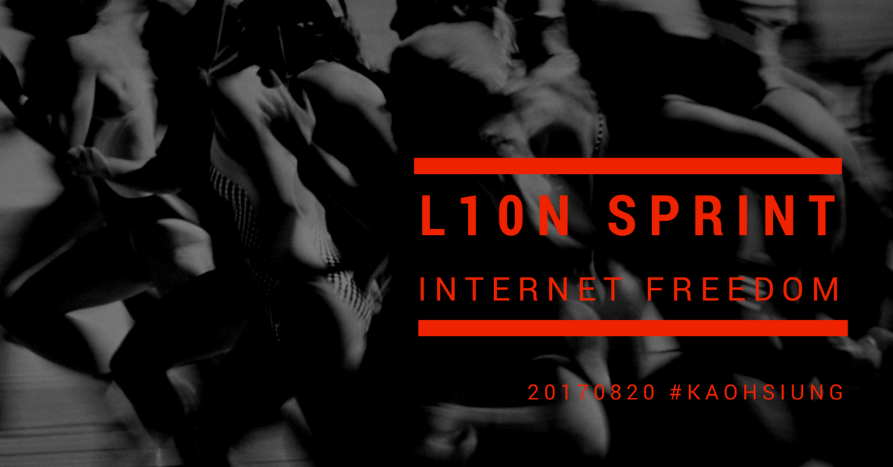

# The Very First Localization Sprint
## 網路自由在地翻譯衝第一次活動　

時間： 2017年8月20日

報名網址：　[https://twngo.kktix.cc/events/l10nsprint](https://twngo.kktix.cc/events/l10nsprint)

## 當天挑戰的翻譯材料資訊滙總：

#### 1. [Umbrella App](https://secfirst.org/) (review + translation) ：Android 手機上的應用程式，提供網路資訊安全與實用工具的介紹。
- [project repository on github](https://github.com/securityfirst/Umbrella_content)

#### 2. [Ooni](https://ooni.torproject.org/) + [MLab Measure](https://www.measurementlab.net/) (review) + Internet Society Perspectives on [Internet Content Blocking: An Overview](https://www.internetsociety.org/doc/internet-content-blocking) (translation + review): 與網路審查封鎖相關的資訊與檢查工具。
- Ooni [project repository on github](https://github.com/TheTorProject/ooni-probe)
- M-Lab [project repository on github](https://github.com/m-lab)

#### 3. [Internet governance resources: Tallinn Manual 2.0](https://hackmd.io/KwDgxgTAjCUGYFoAmAGCAjBAWFBDAbAuklAMwK4oDs6pwpcuEAnMEA==#)《塔林手冊》，又稱網戰聖經，只翻譯交戰條款

#### 4. 其它
- Open Tech Fund/ Localization Lab 為首推動的網路自由軟體在地化專案列表 https://www.transifex.com/otf/public/
　　

## 實用工具列表

[Localization-101-Beginners-Guide-to-Software-Localization](Localization-101-Beginners-Guide-to-Software-Localization.pdf) from [Transifex Resources: 
Learning Center](https://www.transifex.com/resources/)

## 行前通知信內容

#### 有關翻譯事項

1. 當天進行工作的平台之一為  transifex ,若尚未開通 transifex 帳戶者，請事先到[該網站](https://transifex.com)，免費註冊一個帳號。

2. 以 Open Tech Fund/ Localization Lab 為首所推動的網路自由軟體在地化專案列表
     https://www.transifex.com/otf/public/
　　
其中我們週日主要要挑戰的幾個放在 Transifex 上的翻譯專案是

- A. Umbrella App　 https://www.transifex.com/otf/umbrella-app/
- B. OONIPROBE 　 https://www.transifex.com/otf/ooniprobe/
- C. Measurement Lab Chrome App https://www.transifex.com/otf/mlab-app/

　 
請在開通transifex帳號，請求加入其專案的中文小組團隊(大約是在上述連結頁各專案右側會看到"Join Team" 的連結)　
本人  transifex 的帳號為： jxtsai  如果在操作上遇到問題，也可以在上頭傳訊息給我
　
 
3. Transifex 有提供使用翻譯者文件資源 https://www.transifex.com/resources/ ，若有空請自行參考

4. 另外在 github 上有本次相關翻譯挑戰的專案、開發資料整理　https://github.com/twngo/l10n
    （建議沒用過 github 者，也可以申請一個免付費帳號，雖然本次不一定會用到）

5. 請務必記得帶上自己的筆電，如果沒有個人筆電，請回覆本信，商量如何協助處理。

#### 有關場地交通

1. 感謝台灣人權促進會協助提供場地空間，請大家屆時幫忙一起維護環境整潔，尤其若有自用環保杯或餐具，最好記得帶上。

2.  活動地址是在高雄市左營區至聖路312號7樓之2，如搭捷運則在「凹子底」站下車，近3號出口。場地位於住商不動産這幢建築，請從牙醫診所旁的「龍揚庭」大門入口，向管理員說明要到312號7樓（台權會/地球公民學堂/主婦聯盟）參加活動。

3. 請準時在上午10:00 之前在達，但也不必太早到，大約 9:30 之後 才會有人在。當日的緊急聯絡電話是(有需要者，請來信詢問) 這是臨時借來的門號，除非遇上了立即而明顯的危險狀況才使用，如遭警方盤查拘留被黑道綁架....，否則請不用打電話向我問路或問安。

#### 其它事項

1. 當天除午餐外，現場備有零食點心水果，參加者若有私藏推薦的在地異地美食，歡迎帶來和大家分享，以提振埋頭翻譯時無聊或想打瞌睡的士氣。另外，現場有耳掛咖啡包、台灣高山茶、含糖碳酸飲料＋啤酒，如果覺得酒精濃度不夠嗨，可以自己帶酒來～～（但我定下的規則是不可傷身獨飲需邀大家分享）　

2. 本活動支出完全由主辦者私人自掏腰包支付，並無任何官方、財團、機構贊助，特此聲明。

3. 若有其它未盡詳細之處，需要主辦者再努力說明的，可直接回信發問。如果確認當天無法順利出席，也麻煩簡單回個信讓我知道，好掌握人數。　

4. 雖然以上事項有點里里扣扣瑣瑣碎碎，但大家別忘了最重要的是抱著輕鬆愉快的心情一起來吃吃喝喝、認識朋友、交流資訊分享看法、貢獻翻譯投入。　
